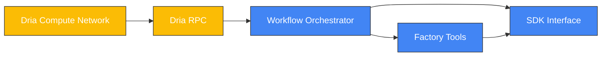

## What is Dria?

Dria is a comprehensive synthetic data infrastructure platform designed to revolutionize AI development. It provides a unique ecosystem where data quality, diversity, and complexity can be balanced together in a single interface, addressing one of the most critical challenges in modern AI development.


How Dria works:

## Dria Network Architecture Components

| Component | Description | Role in the Architecture |
|-----------|-------------|--------------------------|
| **Dria Compute Network** | The distributed computing infrastructure that powers Dria's operations | Provides the computational resources necessary for running AI models and data generation tasks at scale, enabling massive parallelization without requiring users to have their own GPU infrastructure |
| **Dria RPC** | RPC interface that facilitates communication between the compute network and the SDK | Acts as a bridge between the distributed computing resources and the core workflow engine, handling request routing, load balancing, and service discovery |
| **Workflow Orchestrator** | The core processing component that orchestrates workflow execution and coordinates data generation activities | Manages the execution of workflows, schedules tasks, handles dependencies, and ensures efficient resource utilization across the platform |
| **Factory Tools** | A collection of specialized tools and algorithms for data generation and manipulation | Provides pre-built components derived from verified research papers that can be incorporated into workflows to accelerate specific types of data generation tasks |
| **SDK Interface** | Interface that provides a programming interface for users to interact with the Compute Network | Offers a clean, intuitive API for defining workflows, executing data generation tasks, and retrieving results, making the power of the Dria platform accessible through simple Python code |

### How These Components Work Together

1. **User Interaction Flow**:
   - Users define workflows using the **SDK Interface**
   - The SDK communicates with the Dria platform through the RPC layer

2. **Workflow Orchestration**:
   - The **Workflow Orchestrator** analyzes the workflow and determines the execution plan
   - When a workflow is executed, the request is sent to the **Dria RPC** via SDK
   - Computation is distributed across the **Dria Compute Network**

3. **Workflow Execution**:
   - During workflow execution, the **Compute Node** execute the workflow steps as specified by the **Workflow Orchestrator**
   - All tools and instructions are executed on the **Edge Devices**

4. **Result Return**:
   - Generated data flows back through the same path
   - Results are processed by the **Workflow Orchestrator**
   - Final output is delivered to the user through the **Dria SDK**

This architecture enables Dria to provide powerful, scalable synthetic data generation capabilities while maintaining a simple, accessible interface for users.

## Understanding Workflows

Workflows are the fundamental building blocks of Dria's data generation system:

<Steps>
  <Step title="Define Your Workflow">
    A workflow is a structured sequence of steps that defines how synthetic data is generated, processed, and validated.
  </Step>
  <Step title="Compose Modular Components">
    Complex data generation tasks are broken down into modular components that can be combined and reused across different projects.
  </Step>
  <Step title="Customize for Your Needs">
    Each workflow can be tailored to specific data requirements, allowing precise control over the generation process.
  </Step>
  <Step title="Orchestrate Execution">
    Dria manages the execution of workflows, handling dependencies, parallelization, and resource allocation automatically.
  </Step>
</Steps>

## Why use Dria?

Dria provides the scalable and versatile tools you need to accelerate your AI development with high-quality, diverse synthetic datasets:

<CardGroup cols={2}>
  <Card
    title="Massive Parallelization"
    icon="server"
  >
    Offload your compute needs to the network, leveraging massive parallelization without requiring personal GPU infrastructure
  </Card>
  <Card
    title="Flexible Custom Pipelines"
    icon="diagram-project"
  >
    Design complex data generation workflows tailored to your specific needs, all without requiring your own GPUs
  </Card>
  <Card
    title="Extensive Factory"
    icon="toolbox"
  >
    Access a factory of built-in tools derived from verified research papers to significantly speed up the data generation process
  </Card>
  <Card
    title="Grounded in Reality"
    icon="globe"
  >
    Create pipelines where AI can search for grounding in the web or siloed APIs, allowing you to create diverse synthetic data with real-life distribution
  </Card>
</CardGroup>


## Getting Started

To begin using Dria, you'll need to:

<Steps>
  <Step title="Install the SDK">
    Dria works with Python 3.10 or higher and can be installed via pip:
    ```bash
    pip install dria
    ```
    
    Or using conda:
    ```bash
    conda create -n dria python=3.10
    conda activate dria
    pip install dria
    ```
  </Step>
  <Step title="Create Your First Workflow">
    Define the steps needed to generate your synthetic data using our intuitive workflow API.
    ```python
    from dria import Dria, WorkflowTemplate, Model

    class SimpleWorkflow(WorkflowTemplate):
        def define_workflow(self) -> None:
            self.add_step("Write a short story about a {{topic}}")
    ```
  </Step>
  <Step title="Generate Synthetic Data">
    Execute your workflow and collect the generated data through our simple interface.
    ```python
    dria = Dria()
    result = asyncio.run(dria.generate(
        inputs={"topic": "an apple"},
        workflow=SimpleWorkflow,
        models=Model.GEMINI
    ))
    ```
  </Step>
</Steps>

## Next Steps

Check out our documentation to learn more about Dria's capabilities and how to leverage them for your AI development needs.

<CardGroup cols={2}>
  <Card
    title="Quickstart Guide"
    icon="bolt"
    href="/quickstart"
  >
    Get up and running with Dria in minutes
  </Card>
  <Card
    title="Pipeline Examples"
    icon="code"
    href="/essentials/code"
  >
    Explore example pipelines for different use cases
  </Card>
</CardGroup>

<Feedback>
  Was this documentation helpful? Let us know how we can improve it further.
</Feedback>
